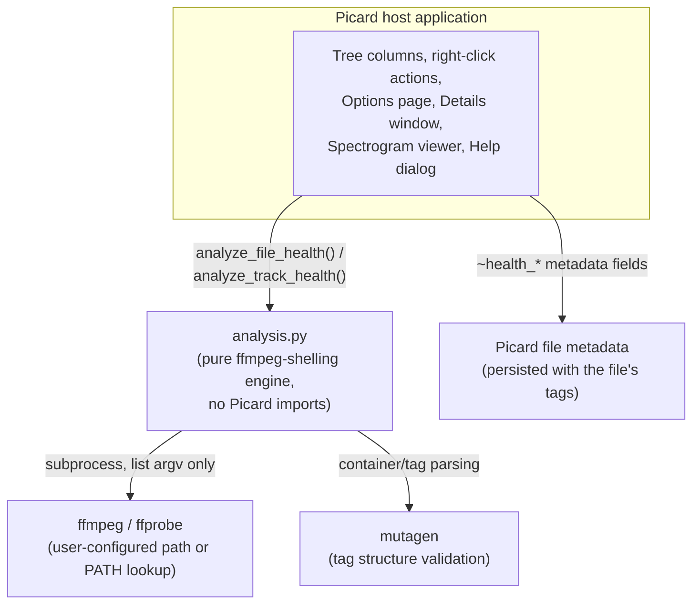

# High-Level Design: File Health

## Problem

Personal music libraries accumulate files whose actual condition their owner can no longer see. A file downloaded years ago from a peer-to-peer source may be silently truncated or a stitched-together concatenation of two separate rips. A CD rip from failing optical media may carry a bit-reservoir corruption that produces an audible click nobody has noticed yet. A file re-tagged by three different tools over a decade may carry a malformed ID3 frame or corrupt embedded artwork that only surfaces when something finally tries to parse it strictly. Separately — and orthogonally — a file may play back perfectly and still sound bad: over-compressed mastering, a lossy transcode re-encoded to look lossless, inverted stereo channels, a declared "hi-res" file that is actually an upsampled ordinary-rate source.

Picard, as a tagging tool, is where a user already spends time deliberately looking at their library file-by-file — but it has no way to surface either kind of problem. A user has no way to find "which of my 40,000 files are actually damaged" or "which of my files sound bad" without external tools, most of which check only one narrow thing (a corruption checksum, a loudness meter, a spectrogram viewer) and none of which integrate into the workflow where the user is already reviewing and fixing metadata.

## Approach

File Health adds two independent, ffmpeg-backed health scores to Picard's file/track views, plus the supporting UI to act on them:

- **File Health** — can this file be trusted structurally? Decode success, audio-stream integrity (corruption signatures, container/size-mismatch), and tag/artwork parseability. A single merged decode per file (via ffmpeg) is scanned lightly; no user-configurable sensitivity, because "is this file structurally sound" is not a matter of taste.
- **Track Health** — how does this file actually sound? A heavier decode measures clipping, true peak, spectral cutoff (transcode/lossy-source detection), fake-hi-res, out-of-phase channels, dynamic range (DR14), mains hum, and noise floor, combined into a single weighted composite score. Every threshold is user-adjustable via sliders, because "how much compression is too much" is a matter of taste Track Health's own users disagree about.

Both scores are calibrated against measurements from the author's own real library (hundreds of files sampled from working, archived, and known-problematic corpora) rather than synthetic fixtures alone — every threshold in the analysis engine has a documented empirical basis for where it sits.

The scores surface through five integration points, each serving a different moment in a Picard workflow: two sortable/filterable tree columns (health at a glance while browsing), two right-click scan actions plus a Tools-menu "scan everything" action (triggering measurement on demand, since scanning is a real per-file decode cost that shouldn't run automatically on every load), a non-modal Details window (side-by-side comparison of duplicate/candidate files, useful when deciding which of several near-duplicates to keep), a spectrogram viewer (visual confirmation for cases where trusting a number requires seeing the actual frequency content), and an in-app Help dialog (since the checks and their thresholds need more explanation than a tooltip can carry).

## Target Users

Picard users curating a personal music library who want to know, without leaving Picard, which files are safe to trust and which need attention before they're archived, shared, or relied upon. This skews toward users with libraries assembled over a long time from mixed sources (personal rips, downloads, transfers between machines) — libraries where structural damage and inconsistent mastering quality are more likely to have crept in than in a library built entirely from a single, recent, high-quality source.

## Goals

- Every gate-check result (the checks that force a "Bad" tier) is a decisive measurement, not a heuristic guess — validated against real files with confirmed-known status (genuinely corrupt, genuinely clean) before being wired into either tier.
- False-positive rate low enough that a user scanning their whole library gets a short, trustworthy list of files that actually need attention, not one dominated by noise. Concretely: informational checks that can't be told apart from a legitimate, non-defective interpretation (mains hum vs. a sustained musical drone; a raised noise floor vs. quiet room tone) never gate a tier on their own.
- A user re-saving a file in Picard for a File-Health issue Picard itself can fix (corrupt embedded artwork, a malformed tag frame) sees that issue resolve after the re-save — not a permanently "Bad" file for a problem the tool in front of them already solves.
- Every measurement the plugin makes is explained in place: a tooltip names the specific defect and, where relevant, which Options-page slider controls its sensitivity.

## Non-Goals

- **Not a repair tool.** File Health identifies problems; it never rewrites audio data, re-encodes, or attempts to fix a corrupt file. (It does interoperate with Picard's own re-save, which happens to fix a narrow subset of File Health issues as a side effect — see Key Design Decisions.)
- **Not a general-purpose audio analysis toolkit.** Checks are scoped to what a Picard user curating a library needs to know before keeping, discarding, or re-encoding a file — not a superset of everything ffmpeg's filters can measure.
- **Not real-time or streaming.** Every scan is a one-shot decode of a file already on disk; there is no live-monitoring or watch-folder mode.
- **No network or cloud dependency.** Every measurement is local, via a user-supplied ffmpeg binary. The plugin never uploads file content or metadata anywhere.
- **No attempt to sandbox against a malicious audio file.** File Health treats an arbitrary user-supplied file as untrusted input to be measured safely (see the File Health LLD's hardening work), but it does not attempt to defend against a compromised ffmpeg binary or a vulnerability inside ffmpeg itself — the plugin's own trust boundary starts after ffmpeg's own security guarantees.

## Tenets

- **Real-library validation over synthetic-only fixtures.** When a threshold can be calibrated against measurements from real, known-status files, do that in preference to reasoning from a synthetic test case alone — synthetic fixtures validate mechanism, real libraries validate calibration.
- **Graceful degradation over hard failure.** A single unmeasurable check (ffmpeg timeout, missing stream, unparseable output) should degrade that one check to "not measured," not abort the whole scan or crash the plugin.
- **Structured data over string-matching at a call site that already has the structured value.** When a caller already knows which detector produced a piece of data, route on that directly rather than re-deriving the same distinction by pattern-matching the resulting text.
- **Concise, plain UI text over exhaustive explanation.** Labels, tooltips, and status messages stay short; a numeric threshold is appended by the shared rendering path rather than spelled out in prose at each call site.
- **Boring, well-worn ffmpeg mechanisms over novel ones.** Prefer an existing ffmpeg filter/flag with well-understood, documented behavior over a hand-rolled equivalent, even when the hand-rolled version could be marginally more precise.

## System Design

- **`analysis.py`** is the whole measurement engine: pure Python, no Picard imports, callable and testable standalone. Every ffmpeg/ffprobe invocation goes through one shared subprocess helper (list-argv only, no shell). One merged ffmpeg invocation per Track Health scan runs every whole-file measurement that doesn't depend on another measurement's result first (clipping, true peak, spectral cutoff, fake-hi-res, phase) via `asplit` into independently-tagged filter branches, rather than one decode per check.
- **`__init__.py`** is all Picard integration: registers the two tree columns (with icon-painting delegates), five actions (File Health scan, Track Health scan, per-file scan variants, a Details window, a "scan everything" Tools-menu action), the Options page (ffmpeg path configuration, per-check sensitivity sliders), the Details window, and the spectrogram viewer. Contains no ffmpeg-invocation logic of its own — every measurement call goes through `analysis.py`.
- **`help_content.py`** holds the in-app Help dialog's four tabs as static HTML strings — no dynamic interpolation of file- or tag-derived data, kept that way deliberately (see Key Design Decisions).
- Scan results persist as `~health_*` Picard metadata fields on the file (tier, itemized issues, informational notes, a content hash to detect "file changed since last scan," and per-metric raw values for the Details window's live re-scoring against current slider settings). Metadata persistence means results survive a Picard restart and travel with the file's own tags.
- Every scan runs on a background thread via Picard's own thread pool (the same mechanism Picard's core AcoustID fingerprinting uses), never blocking the UI thread.

## Key Design Decisions

- **Two independent scores, not one.** File Health (structural, no user-configurable sensitivity) and Track Health (perceptual/mastering, fully slider-configurable) answer different questions a user asks at different moments — "can I trust this file at all" vs. "does this sound good" — and conflating them into one score would force a structurally-broken file and a merely-over-compressed one into the same bucket, or force "corruption" itself to become a matter of taste. Kept independent even though a decode failure produces the same terminal verdict, `Unplayable`, on both scores — Track Health never reads File Health's stored result; it independently discovers the same physical fact (this file won't decode) and labels its own conclusion with the same name so a user reading either column interprets it consistently. See the Track Health LLD for why the two scores share this one terminal name without becoming coupled.
- **File Health issues split by fixability, not just detected-vs-not.** Within File Health, issues that Picard's own re-save already fixes (corrupt embedded artwork, a malformed tag frame) cap at the "OK" tier rather than forcing "Bad" — a "Bad" verdict for a problem solvable by clicking Save in the same application showing the verdict would train users to distrust the tool's own severity signal. Genuine structural defects (decode-level corruption signatures, a Xing-header size mismatch indicating truncation or concatenation) still force "Bad," since nothing short of re-encoding from a clean source fixes those. The split is implemented by categorizing issues at the point they're detected (two separate lists passed to the tier computation), not by pattern-matching issue text after the fact.
- **Single merged ffmpeg decode for Track Health, not one invocation per check.** Track Health's checks (clipping, true peak, spectral cutoff, fake-hi-res, phase, loudness) all need the same decoded PCM; `asplit` feeds one decode into independently-tagged parallel filter branches in one invocation, roughly halving total scan time against the naive one-decode-per-check approach and making the DR14 pass (which needs its own block-windowed decode) the only genuinely separate invocation.
- **Calibrated thresholds cite their own validation data, in-line.** Every threshold constant in `analysis.py` carries a comment naming what real-file sample it was validated against and what separation it achieved — not just what the number is. A threshold whose provenance isn't legible from reading the constant is a threshold nobody can safely revise later.
- **ffmpeg's own stderr diagnostic output is parsed defensively, not trusted as clean.** ffmpeg prints a scanned file's own container/tag values into the same stderr stream its filters use for diagnostic output. Every parser that reads that stream is scoped to its own filter instance's tagged log lines (or, where a filter's own tag doesn't cover the data, anchored to ffmpeg's own unspoofable log-line format) specifically so a maliciously crafted tag value in a file being scanned can't be echoed back and misread as a real measurement. This is treated as a correctness property of the analysis engine, not an optional hardening pass — the whole point of File Health is to be trustworthy about untrusted input.
- **No shell, ever.** Every ffmpeg/ffprobe call passes argv as a list to `subprocess.run`, never a shell string — a scanned filename is adversary-controlled in the general case (a downloaded file), and shell interpretation of that filename is a class of bug this design refuses to introduce.
- **help_content.py is 100% static.** The in-app Help dialog never interpolates a filename, tag value, or any other file-derived string into its HTML — it explains the checks and thresholds themselves, not any one file's specific results. This keeps one whole surface of the plugin immune by construction to any HTML/script-injection concern from crafted file content.

## Success Metrics

- A scan of a real, mixed-quality library produces a "Bad" File Health list that, spot-checked, is dominated by files with confirmable structural defects (not false positives) — falsified by a spot-check majority of "Bad" files playing back audibly fine with no confirmable structural issue.
- Track Health's default thresholds produce a tier distribution with a genuinely small "Bad" tail on an ordinary personal library (most files cluster in the middle tiers) — falsified by "Bad" becoming the majority verdict on an otherwise unremarkable library, which would indicate miscalibration rather than a library-specific finding.
- A user can identify what a "Bad" or flagged result means and what to do about it from the column tooltip alone, without opening the Help dialog — falsified by a support question that the existing tooltip text should have already answered.

## References

- ffmpeg filter documentation (`astats`, `volumedetect`, `ebur128`, `aphasemeter`, `silencedetect`, `showspectrumpic`) — the measurement primitives every check in `analysis.py` is built from.
- Pleasurize Music Foundation "TT DR Meter" specification — the DR14 dynamic-range algorithm Track Health reimplements against ffmpeg's own `astats` output.
- HydrogenAudio/Xiph published listening-test consensus bitrate thresholds — the basis for the below-transparency-bitrate informational note.
